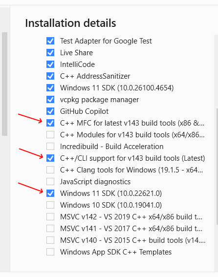

# Compiling Delft3D on Windows
Back to main [development page](development.md).

The Delft3D build on Windows uses **Conan 2** to manage third-party dependencies, **CMake** to generate the Visual Studio solution, and **Visual Studio + Intel oneAPI** to compile.
Two helper scripts in the repository root tie everything together:

- [run_conan.py](../run_conan.py) — one-time Conan configuration and dependency install.
- [build.py](../build.py) — runs Conan, CMake configure, and (optionally) build and install.

Pre-built binary packages for the third-party dependencies are hosted on the Deltares Nexus
([internal-artifacts.deltares.nl](https://internal-artifacts.deltares.nl/)).
Deltares developers download them directly and external developers build them locally from the recipes in [conan/recipes](../conan/recipes).

## Prerequisites
- Microsoft Visual Studio, this can be the Enterprise Edition, Professional Edition, or the [Community Edition](https://visualstudio.microsoft.com/vs/community/).
  During the installation/configuration process, choose the **"Desktop development with C++"** configuration.
  Make sure to include under the list of installation details on the right side of the installation dialog the items **"C++/CLI support"**, **"C++ MFC"**, and the latest **"Windows SDK"**; see the figure below.

  

  Links to previous Visual Studio Community Editions can be found [here](https://www.junian.net/dev/visual-studio-community-download-links/).
  See the note below on the use of different versions.
- You may use [Visual Studio Code](https://code.visualstudio.com/) as the development environment, but a Visual Studio installation is still required for the C++ compiler and the Intel Fortran installation.
- [Intel oneAPI Fortran Compiler](https://www.intel.com/content/www/us/en/developer/tools/oneapi/fortran-compiler-download.html) Please make sure that it's integrated into the Visual Studio environment installed above.
  See the note below on the use of different versions.
- [Intel oneAPI MPI Library](https://www.intel.com/content/www/us/en/developer/tools/oneapi/mpi-library.html)
- [Intel oneAPI Math Kernel Library](https://www.intel.com/content/www/us/en/developer/tools/oneapi/onemkl-download.html)
- [CMake](https://cmake.org/download/) for configuring the build environment.
- [Git](https://gitforwindows.org/) for downloading the Delft3D source code from this repository.
  If you prefer graphical user interfaces over command lines, you may want to additionally install [GitExtensions](https://gitextensions.github.io/) and/or [TortoiseGit](https://tortoisegit.org/).
  The former tool is generally considered more powerful and true to Git.
  The latter tool offers icon overlays for commit status.
- [Python](https://www.python.org/downloads/) for the build scripts and the Conan package manager.
  The recommended way to install Python within Deltares is via [uv](https://docs.astral.sh/uv/):
  ```
  uv python install
  ```
  Alternatively, install Python directly from [python.org](https://www.python.org/downloads/).
- [Conan 2](https://docs.conan.io/2/installation.html). The recommended way to install Conan within Deltares is also via [uv](https://docs.astral.sh/uv/):
  ```
  uv tool install conan
  ```
  Alternatively, install it into your active Python environment with pip:
  ```
  python -m pip install conan
  ```
  Verify the installation:
  ```
  conan --version
  ```
- External developers and developers of Conan packages on Windows need [Cygwin](https://www.cygwin.com/)
  to build the PETSc Conan package from source. Install the 64-bit version in `C:\cygwin64` and
  select the `make` and `python3` packages in the Cygwin installer. Developers with access to the Deltares
  network are not required to install Cygwin if they only consume Conan packages.

**Note**
- We are currently using Visual Studio 2022 and Intel oneAPI 2024.2 for the official release.
  Visual Studio 2026 and Intel oneAPI 2025.3 were used successfully to build the software, but we have not yet thoroughly tested the resulting binaries.
  Since the Windows build includes third-party libraries that have been compiled using Visual Studio 2022 against Intel oneAPI 2024.2, runtime problems are possible.
  We aim to transition to the updated versions in the near future.


## Getting the source

Clone the repository from https://github.com/Deltares/Delft3D:
```
git clone https://github.com/Deltares/Delft3D.git
```


## One-time Conan setup

Before building for the first time you need to install the Conan profile (compiler/toolchain
description), configure some conan settings, and configure the remotes from where Conan downloads packages.
The helper script [run_conan.py](../run_conan.py) takes care of this.
Run it from the repository root.

### Deltares developers (with Nexus access)

**1. Install the Conan configuration.**
From the repository root:
```
python run_conan.py initialize deltares
```
This installs the compiler profile, global settings, and registers the Deltares Nexus remotes (`delft3d-conan-dev` and `deltares-conan-center-proxy`).
It also creates the Conan home directory (`%USERPROFILE%\.conan2\`) if it did not yet exist.

**2. Configure Nexus credentials.**
Visit the [user token page](https://internal-artifacts.deltares.nl/#user/usertoken) on Nexus
(sign in with SSO using your Deltares credentials).
Click the user button at the top right, then **User Token** and **Access user token**.
Copy the user token name and user token pass code. These tokens expire after a year
or can be reset manually.

Create a file called `credentials.json` in your Conan home directory (`~/.conan2`) with the
following content (replace `<NEXUS_USER_NAME>` and `<NEXUS_PASS_CODE>`):
```json
{
    "credentials": [
        {
            "remote": "delft3d-conan-dev",
            "user": "<NEXUS_USER_NAME>",
            "password": "<NEXUS_PASS_CODE>"
        },
        {
            "remote": "deltares-conan-center-proxy",
            "user": "<NEXUS_USER_NAME>",
            "password": "<NEXUS_PASS_CODE>"
        }
    ]
}
```

### External / open-source developers (without Nexus access)

From the repository root:
```
python run_conan.py initialize external
```
This installs the same compiler profile and settings. Please check the conan profile in your local Conan
cache under `%USERPROFILE%\.conan2\profiles\delft3d_windows_msvc_194_v2`. If you installed Cygwin in a
different location than `C:\cygwin64`, then change your Conan profile to point to Cygwin's `bash.exe`
using the `tools.microsoft.bash:path` option.

Next, you can build all third-party dependencies locally from the recipes in
[conan/recipes](../conan/recipes). Once built, the packages are cached in `%USERPROFILE%\.conan2` and
reused on subsequent builds. You only have to rebuild them when the recipes change.

When invoking the build script you will need to pass the additional `--build-dependencies` flag (see below).

## Build steps

Open an **Intel oneAPI command prompt for Intel 64 for Visual Studio XXX** (find it in your Windows Start menu) and change to the repository root.

Run `python build.py --help` to see all supported command line options.

### Deltares developers

By default, `build.py` creates the build environment for the Delft3D FM Suite (`fm-suite`).
You can also build environments for the Delft3D 4 Suite (`d3d4-suite`) or everything (`all`) via the `--config` option.

To configure only (generates the Visual Studio solution, then open it manually):
```
python build.py
```

To configure, build, and install in one go:
```
python build.py --build
```

### External / open-source developers

The first time you build (or after a recipe change), pass `--build-dependencies` so that all third-party
dependencies are compiled from the local recipes instead of fetched from Nexus:
```
python build.py --build --build-dependencies
```
Conan caches the built packages in `%USERPROFILE%\.conan2\`.
Subsequent invocations reuse the cached packages, so `--build-dependencies` is only needed again
after a recipe change. Still, passing `--build-dependencies` does nothing unless there are
missing third-party packages.

### Opening the solution in Visual Studio

Open the generated solution from the **Intel oneAPI command prompt for Intel 64 for Visual Studio XXX** to make sure the Intel environment is inherited by Visual Studio. For example:
```
devenv build_fm-suite\fm-suite.sln
```
or
```
devenv build_fm-suite\fm-suite.slnx
```
for Visual Studio 2026.
Most compilation steps work fine when the solution is opened outside the Intel oneAPI environment, but you will see some [MSB3073](https://learn.microsoft.com/en-us/visualstudio/msbuild/errors/msb3073) errors with a description starting with `The command "setlocal`.
Those errors are related to the collection step for the GoogleTest framework.

You can also build from the command line:
```
cmake --build build_fm-suite --config Debug
cmake --install build_fm-suite --config Debug
```
to build the debug version of the Delft3D FM binaries.

## Power-user workflow (raw Conan + CMake)

`run_conan.py` and `build.py` are thin wrappers around `conan` and `cmake` that cover the common
use cases (and the more complex orchestration required by TeamCity). If you want full control,
for example to iterate on CMake without re-running Conan, or to use a non-default profile,
you can drive `conan` and `cmake` directly inside the build container.

Make sure the Delft3D Conan configuration (profiles, settings, remotes) is installed in your
Conan home. You can do this with the raw `conan` command:
```bat
conan config install conan\config
```
This is what `python run_conan.py initialize deltares` does under the hood. The `external`
variant additionally removes the Nexus remotes and registers [conan/recipes](../conan/recipes)
as a `local-recipes-index` remote. See [run_conan.py](../run_conan.py) for details.

The Conan profile is `delft3d_windows_msvc_194_v2` and the lockfile [conan.lock](../conan.lock)
pins recipe revisions for reproducibility.

The Visual Studio generator is multi-config, so a single build directory hosts `Debug`, `Release`
and `RelWithDebInfo`. The third-party packages themselves are always built/downloaded as
`Release`, while the consumer build type is selected per `conan install` call via `&:build_type=...`.
Run `conan install` once per configuration you want to consume:

```bat
:: 1. Install dependencies for all three configurations.
::    The first call may build packages (or download them from Nexus). The other two reuse the cache.
conan install . --profile:all=delft3d_windows_msvc_194_v2 ^
      --settings:all build_type=Release ^
      --output-folder=build_fm-suite\conan ^
      --lockfile=conan.lock

conan install . --profile:all=delft3d_windows_msvc_194_v2 ^
      --settings:all build_type=Release ^
      --settings:all &:build_type=Debug ^
      --output-folder=build_fm-suite\conan ^
      --lockfile=conan.lock

conan install . --profile:all=delft3d_windows_msvc_194_v2 ^
      --settings:all build_type=Release ^
      --settings:all &:build_type=RelWithDebInfo ^
      --output-folder=build_fm-suite\conan ^
      --lockfile=conan.lock

:: 2. CMake configure
cmake -S .\src\cmake -B build_fm-suite -T fortran=ifx -A x64 ^
      -D CONFIGURATION_TYPE:STRING="fm-suite" ^
      -D CMAKE_INSTALL_PREFIX=.\install_fm-suite

:: 3. Build & install
cmake --build build_fm-suite --config Debug --parallel
cmake --install build_fm-suite --config Debug
```

To build missing dependencies from source (e.g. after changing a recipe), add `--build=missing` to
the first `conan install` call:
```bat
conan install . --profile:all=delft3d_windows_msvc_194_v2 ^
      --settings:all build_type=Release ^
      --output-folder=build_fm-suite\conan ^
      --lockfile=conan.lock ^
      --build=missing
```
Use `--build=*` (and `--remote=local-recipes`) instead to rebuild every package from the local
recipes only. This is what external developers do via `build.py --build-dependencies`.
