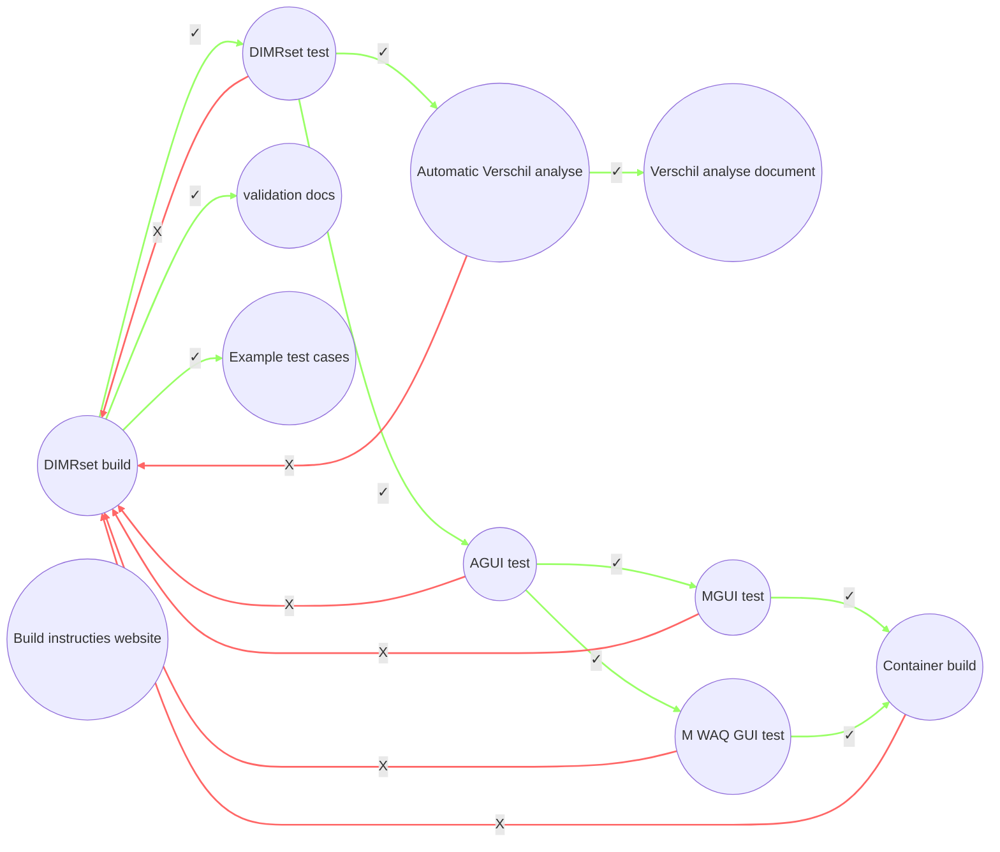

```mermaid
graph LR
    %% Nodes
    A((DIMRset build))
    B((DIMRset test))
    C((validation docs))
    D((Example test cases))
    E((Automatic Verschil analyse))
    F((Verschil analyse document))
    G((AGUI test))
    H((MGUI test))
    I((M WAQ GUI test))
    J((Container build))
    K((Build instructies website))

    %% Links
    A -->|✓| B
    A -->|✓| C
    A -->|✓| D
    B -->|✓| E
    B -->|✓| G
    E -->|✓| F
    G -->|✓| H
    G -->|✓| I
    H -->|✓| J
    I -->|✓| J
    B -->|X| A
    E -->|X| A
    G -->|X| A
    H -->|X| A
    I -->|X| A
    J -->|X| A

    %% Styles
    classDef green fill:#9f6,stroke:#333,stroke-width:2px,fill-opacity:0.5;
    classDef blue fill:#69f,stroke:#333,stroke-width:2px;
    classDef red fill:#f66,stroke:#333,stroke-width:2px;
    classDef yellow fill:#ff6,stroke:#333,stroke-width:2px;
    classDef orange fill:#f96,stroke:#333,stroke-width:2px;

    %% Link Styles
    linkStyle 0,1,2,3,4,5,6,7,8,9 stroke:#9f6,stroke-width:2px;
    linkStyle 10,11,12,13,14,15 stroke:#f66,stroke-width:2px;
```